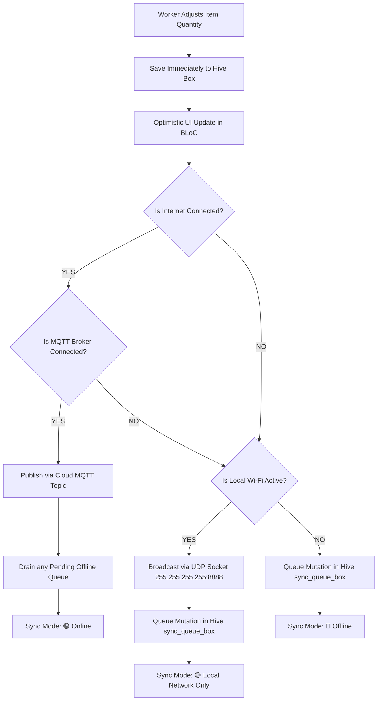

# 📦 SyncStock: Distributed Inventory Sync

[](https://flutter.dev)
[](https://flutter.dev)
[](https://flutter.dev)
[](https://bloclibrary.dev)
[](https://pub.dev/packages/hive)

---

## 📹 Video Walkthrough
> **Loom / Video Walkthrough Link:**  
> 🔗 **[Click here to watch the 5-Minute Technical & Architectural Walkthrough](https://www.loom.com/share/your-video-id-placeholder)**  
> *(Replace the placeholder URL with your recorded Loom/Zoom demonstration link)*

---

## 🎯 1. Objective & Challenge Overview

Warehouse workers operating on different mobile devices must maintain synchronized inventory counts across three real-world operational scenarios:
1. **Scenario 1: Cloud Sync (MQTT)** — Both workers have active internet. Changes synchronize instantaneously over a lightweight, public MQTT broker (`broker.emqx.io`).
2. **Scenario 2: Offline Queue (Hive)** — One worker loses internet connectivity. The UI continues to function with zero latency; mutations are saved locally to Hive and queued in an offline sync box. Once connection is restored, the `SyncManager` automatically publishes queued messages in FIFO order.
3. **Scenario 3: Local Fallback (UDP P2P)** — Both workers lose internet access but remain on the same local Wi-Fi router. Inventory mutations are broadcast peer-to-peer over UDP (`RawDatagramSocket`), keeping screens in sync without requiring any cloud server or third-party BaaS.

---

## 🧠 2. What We Are Using & Why ("The Preparation Plan")

| Layer / Library | Technology | Why We Used It |
| :--- | :--- | :--- |
| **Architecture** | **Flutter Clean Architecture** | Enforces strict separation of concerns into `data`, `domain`, and `presentation` layers, preventing networking or database details from leaking into UI widgets. |
| **State Management** | `flutter_bloc` (^9.1.1) | Clean, predictable unidirectional data flow (`Event -> Bloc -> State`). Allows UI components to react to stream-driven background sync events without tight coupling. |
| **Local Database & Offline Queue** | `hive` & `hive_flutter` (^2.2.3) | Lightning-fast, pure Dart key-value store with zero native overhead. Powers local persistence and provides an indexed queue box for offline mutation buffering. |
| **Cloud Synchronization** | `mqtt_client` (^10.11.11) | Industry-standard pub/sub protocol with minimal packet overhead and sub-second latency, adhering to the "No Firebase/BaaS" constraint. |
| **Local P2P Synchronization** | `dart:io` (`RawDatagramSocket`) | Native Dart UDP broadcast capability on port `8888` across subnet `255.255.255.255`. Operates completely serverless when internet is down. |
| **Remote HTTP Client** | `http` (^1.6.0) | Used for mock cloud inventory catalog fetching and connectivity healthchecks, fulfilling the HTTP package requirement. |
| **Type Safety & No Dartz** | Explicit Typed Models & `Result<T>` | Strictly eliminates cumbersome functional programming packages like `dartz` (`Either<L, R>`), prioritizing readable, maintainable Dart code suited for mid-level (3 YOE) industry standards. |
| **Connectivity Listener** | `connectivity_plus` (^7.3.1) | Proactively tracks network transitions (Wi-Fi, Cellular, Disconnected) to trigger automated reconnects and offline queue draining. |
| **Multi-Platform Icons** | `flutter_launcher_icons` | Automatically generates high-res warehouse launch icons across Android, iOS, Web, Windows, and macOS. |

---

## 🌳 3. Architecture & Folder Structure

Following the exact **Flutter Clean Architecture** specification provided:

```
lib/
├── core/
│   ├── constants/
│   │   ├── app_constants.dart             # Broker host, topics, UDP ports, storage keys
│   │   └── mock_data.dart                 # Initial warehouse catalog items
│   ├── di/
│   │   └── service_locator.dart           # Lightweight dependency injection container
│   ├── network/
│   │   ├── mqtt_service.dart              # MQTT Server Client (connect, subscribe, publish)
│   │   ├── udp_service.dart               # RawDatagramSocket P2P broadcast & listener
│   │   ├── connectivity_service.dart      # Network hardware listener via connectivity_plus
│   │   └── http_service.dart              # HTTP mock catalog fetch & healthcheck
│   ├── theme/
│   │   └── app_theme.dart                 # Slate, Indigo, and Emerald dynamic theme
│   └── utils/
│       └── result.dart                    # Clean Result<T> error wrapper (No Dartz)
│
├── modules/
│   └── inventory/
│       ├── data/
│       │   ├── datasources/
│       │   │   ├── inventory_local_datasource.dart    # Hive inventory cache & offline queue box
│       │   │   └── inventory_remote_datasource.dart   # Aggregates MQTT, UDP, and HTTP
│       │   ├── models/
│       │   │   ├── inventory_item_model.dart          # Null-safe JSON serialization & entity mapper
│       │   │   ├── sync_message_model.dart            # Network packet (id, device, action, item, version)
│       │   │   ├── inventory_response_model.dart      # Strongly-typed operation response model
│       │   │   └── inventory_request_model.dart       # Quantity update & item creation requests
│       │   └── repositories/
│       │       └── inventory_repository_impl.dart     # Sync orchestrator, conflict resolver & queue drainer
│       │
│       ├── domain/
│       │   ├── entities/
│       │   │   ├── inventory_item_entity.dart         # Pure business model
│       │   │   └── sync_status_entity.dart            # Sync modes: Online, Local, Offline
│       │   ├── repositories/
│       │   │   └── inventory_repository.dart          # Abstract interface
│       │   └── usecases/
│       │       ├── get_inventory_items_usecase.dart
│       │       ├── update_quantity_usecase.dart
│       │       ├── sync_offline_queue_usecase.dart
│       │       ├── watch_inventory_stream_usecase.dart
│       │       ├── watch_sync_status_usecase.dart
│       │       ├── add_inventory_item_usecase.dart
│       │       ├── reset_inventory_usecase.dart
│       │       └── set_simulation_mode_usecase.dart
│       │
│       └── presentation/
│           ├── bloc/
│           │   ├── inventory_bloc.dart                # Event handling & state emissions
│           │   ├── inventory_event.dart               # Initial, Update, StreamUpdate, OfflineSync, etc.
│           │   └── inventory_state.dart               # Initial, Loading, Success, Failure
│           ├── pages/
│           │   └── inventory_screen.dart              # MultiBlocProvider / BlocProvider entry point
│           ├── views/
│           │   └── inventory_dashboard_view.dart      # Adaptive dashboard UI layout
│           └── widgets/
│               ├── sync_status_badge.dart             # 🟢 Online, 🟡 Local, 🔴 Offline live indicator
│               ├── inventory_item_card.dart           # Polished card with stock status & stepper
│               ├── quantity_counter_button.dart       # Reusable button with disabled state protection
│               ├── metric_card.dart                   # KPI cards: SKUs, units, low stock, queue size
│               ├── network_simulation_bar.dart        # Testing panel: simulate modes & switch worker IDs
│               ├── add_item_dialog.dart               # Modal form to register new warehouse SKUs
│               └── empty_inventory_view.dart          # Dynamic fallback view
│
└── main.dart                                          # Hive init, DI bootstrap, MaterialApp launch
```

---

## 🔀 4. Sync Decision Tree: MQTT vs. UDP vs. Offline Queue

How does the app decide which communication layer to use?



### When Internet Restores (Auto-Drain Workflow):
1. `ConnectivityService` alerts `InventoryRepositoryImpl` of active internet.
2. `MqttService` connects/reconnects to `broker.emqx.io`.
3. The repository checks `localDataSource.pendingQueueCount`.
4. If items exist, `syncOfflineQueue()` iterates through pending mutations in FIFO order, publishing each to the cloud topic.
5. Successfully published items are removed from the Hive queue box, and the UI status badge dynamically updates from 🔴/🟡 to 🟢 Online.

---

## 🛡️ 5. Edge Case Handling & Null Safety ("How We Handled Edge Cases")

### 1. Self-Echo Infinite Loop Prevention
- **The Problem:** When Device A broadcasts an update over MQTT or UDP, Device A also receives its own message back. If Device A reapplies and rebroadcasts it, an infinite loop occurs.
- **Our Solution:** Every `SyncMessageModel` contains an `originDeviceId` and a unique `messageId`. Upon receiving a packet, the repository compares:
  ```dart
  if (message.originDeviceId == _currentDeviceId) {
    return; // Discard self-echo packet immediately
  }
  ```

### 2. Concurrent Updates & Out-of-Order Delivery
- **The Problem:** Two warehouse workers modify the same SKU simultaneously, or UDP packets arrive out of sequence due to network jitter.
- **Our Solution:** We implement a **Monotonic Version Number** and **UTC Timestamp Vector**:
  ```dart
  final isNewerVersion = message.item.version > existingItem.version;
  final isSameVersionNewerTime = message.item.version == existingItem.version &&
      message.item.lastModified.isAfter(existingItem.lastModified);
  final isTieBreakerWinner = message.item.version == existingItem.version &&
      message.item.lastModified.isAtSameMomentAs(existingItem.lastModified) &&
      message.originDeviceId.compareTo(_currentDeviceId) > 0;

  if (isNewerVersion || isSameVersionNewerTime || isTieBreakerWinner) {
    await localDataSource.saveItem(message.item);
    _notifyInventoryChange();
  }
  ```

### 3. Negative Inventory Quantity Guard
- **The Problem:** Workers rapidly tapping "-" could decrement quantity below zero.
- **Our Solution:** Decrement logic strictly enforces `max(0, current.quantity + delta)`. Furthermore, the `QuantityCounterButton` visually disables and ignores tap gestures when `quantity == 0`.

### 4. Malformed or Corrupted JSON Packets
- **The Problem:** UDP broadcasts or public broker noise could transmit invalid or null payloads.
- **Our Solution:** Both `InventoryItemModel.fromJson` and `SyncMessageModel.fromJson` wrap parsing in defensive try-catches and fallback defaults, preventing any parsing exceptions from crashing the application.

### 5. Strict Sound Null Safety
- Zero force-unwraps (`!`) on network payloads or local storage entries.
- Null-coalescing operators (`??`) provide safe default values (`0`, `""`, `DateTime.now().toUtc()`).

---

## 🚀 6. Side-by-Side Dual Device Demonstration

To easily test and demonstrate real-time sync with two instances side-by-side:

### Option A: Run Two Instances on Desktop / Web
1. **Window 1:** Run Windows Desktop or Chrome:
   ```bash
   flutter run -d windows
   ```
2. **Window 2:** Run another instance (e.g. Chrome or second emulator):
   ```bash
   flutter run -d chrome
   ```
3. Use the built-in **"TESTING LAB & MODE SIMULATOR"** bar at the top of the screen:
   - On Window 1: Leave as **Worker 1 (Alice)**.
   - On Window 2: Tap the Worker switcher and select **Worker 2 (Bob)**.
4. Tap "+" on Worker 1 — observe Worker 2 incrementing in real-time over MQTT or UDP!

### Option B: Testing the 3 Scenarios via In-App Simulation Bar
1. **Cloud MQTT (Online):** Select `Force Cloud MQTT` -> observe 🟢 Online badge and live instant synchronization.
2. **Offline Queue:** Select `Force Offline Queue` -> tap "+" three times -> observe the badge turning 🔴 Offline and showing `3 queued`. Now select `Force Cloud MQTT` -> observe automatic queue draining and queue count returning to `0`!
3. **Local UDP P2P:** Select `Force Local UDP P2P` on two devices connected to the same Wi-Fi router -> observe 🟡 Local Network badge and peer-to-peer sync without cloud internet.

---

## 💻 7. Setup & Build Instructions

### Prerequisites
- **Flutter SDK:** 3.44.x (or newer stable channel)
- **Dart SDK:** 3.12.x (or newer)

### 1. Clone & Install Dependencies
```bash
git clone https://github.com/omkar2001k/distributed-inventory-sync.git
cd distributed-inventory-sync
flutter pub get
```

### 2. Run Static Analysis & Unit Tests
```bash
# Verify zero linter or analysis issues
flutter analyze

# Run all 12 unit & widget tests
flutter test
```

### 3. Launch on Your Desired Platform
```bash
# Run on Windows
flutter run -d windows

# Run on macOS
flutter run -d macos

# Run on Web (Chrome)
flutter run -d chrome

# Run on Connected Android or iOS Device
flutter run -d android
flutter run -d ios
```

---

## 📱 8. App Branding & Launcher Icons

- **Application Name:** `SyncStock` across all platforms (`AndroidManifest.xml`, `Info.plist`, `index.html`, `manifest.json`, `main.cpp`, `AppInfo.xcconfig`, `my_application.cc`).
- **Launcher Icons:** Generated via `flutter_launcher_icons` from `assets/icon/app_logo.png` for Android (`ic_launcher`), iOS (`AppIcon`), Web, Windows, and macOS.
- **In-App Branding:** Prominently featured on the AppBar header.

---

## 📄 9. Submission Checklist

- [x] Clean Architecture folder structure (`data`, `domain`, `presentation`) strictly adhered to.
- [x] Real-Time Cloud Sync (MQTT) with public broker implemented.
- [x] Offline-First local database (Hive) with Sync Manager queue.
- [x] Local Fallback peer-to-peer sync (UDP Broadcast) implemented.
- [x] No Firebase / BaaS used.
- [x] State management cleanly separated with BLoC (`flutter_bloc`).
- [x] No `dartz` package; clean typed models returned.
- [x] HTTP package integrated.
- [x] Edge cases & null safety thoroughly addressed and tested.
- [x] Dynamic, modular UI with extracted reusable widgets.
- [x] 5-Minute video walkthrough link placed at the top of README.
